  

  
  

 

  

## Sobre mim

Atuo na construção de produtos corporativos com foco em front-end, integrações e qualidade de código.

Gosto de transformar regras de negócio complexas em interfaces claras, componentizadas e fáceis de evoluir. Trabalho principalmente com TypeScript, Angular, React e Node.js, sempre buscando um equilíbrio bom entre produto, arquitetura e manutenção.

## Stack principal

  

 

## Como eu penso software

  

## GitHub em movimento

  

  

## Commit arcade

  <picture>
    <source media="(prefers-color-scheme: dark)" srcset="https://raw.githubusercontent.com/Munardt/Munardt/output/github-contribution-grid-snake-dark.svg" />
    <source media="(prefers-color-scheme: light)" srcset="https://raw.githubusercontent.com/Munardt/Munardt/output/github-contribution-grid-snake.svg" />
    
  </picture>

  

